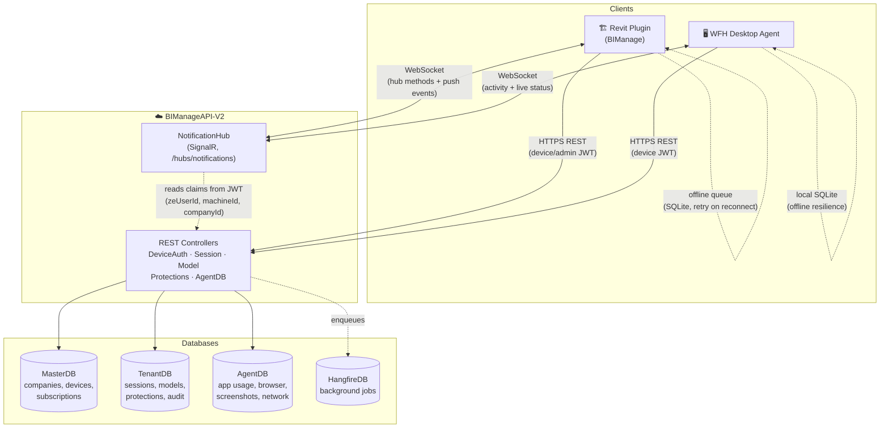

# ZeManage 2.0 — System Architecture & Integration Reference

What each component implements, which backend endpoints and SignalR methods it uses, and how the Revit plugin and WFH desktop agent connect to the shared BIManageAPI-V2 backend.

**Components:** Revit Plugin (BIManage) · WFH Desktop Agent · BIManageAPI-V2 Backend
**Backend base URL:** configurable, e.g. `http://10.10.40.75:5000`

---

## Table of Contents

1. [Overview](#overview)
2. [Architecture Diagram](#architecture-diagram)
3. [Backend API](#backend-api--bimanageapi-v2)
   - [Databases](#databases)
   - [Auth & Token Claims](#auth--token-claims)
   - [NotificationHub (SignalR)](#notificationhub-signalr)
4. [Revit Plugin](#revit-plugin--bimanage)
   - [Logic / Subsystems](#logic--subsystems)
   - [REST Endpoints](#rest-endpoints)
   - [SignalR Usage](#signalr-usage)
   - [Offline Queue](#offline-queue)
5. [WFH Desktop Agent](#wfh-desktop-agent)
   - [Logic / Monitors](#logic--monitors)
   - [REST Endpoints](#rest-endpoints-1)
   - [SignalR Usage](#signalr-usage-1)
   - [Local Persistence](#local-persistence)
   - [Sync Cadence](#sync-cadence)

---

## Overview

ZeManage 2.0 is built from three deployables sharing one backend API and one SignalR hub. Both clients authenticate as a **device** first, then optionally elevate to an **admin session** for role-gated features.

### 🏗️ Revit Plugin (BIManage)
*Runs inside Autodesk Revit*
- Admin sign-in, role-based ribbon
- Session & model tracking
- Command / event / rule / PIN protection enforcement
- Offline queue + background sync
- License validation, AI terminal, evidence capture

### 🖥️ WFH Desktop Agent
*Background service + tray app*
- Foreground app / process tracking
- Browser tab activity
- Idle / network / hardware monitoring
- Screenshot capture (scheduled + on-demand)
- Admin active/inactive kill-switch

### ☁️ BIManageAPI-V2
*Shared backend*
- 4 logical databases (Master / Tenant / Agent / Hangfire)
- Device + admin JWT auth
- NotificationHub (SignalR) for real-time push
- REST controllers per domain (sessions, models, protections, activity)

> **Identity model:** both clients resolve a stable `zeUserId` deterministically from `Hash(companyId, windowsSid)`, independent of which physical machine or which product (Revit plugin vs Agent) reports it — this is the key the backend uses to target a person across devices (force-logout, active/inactive toggle) rather than a specific machine.

---

## Architecture Diagram

---

## Backend API — BIManageAPI-V2

Shared backend serving both clients. Full controller-by-controller inventory lives in the Revit and Agent sections below; this section covers what's common to both.

### Databases

| Database | Context | Used by | Holds |
|---|---|---|---|
| **MasterDB** | `MasterDbContext` | Both | Companies, subscriptions/modules, provider-team users, license keys, device/machine identity shared by Revit device-auth and Agent register/heartbeat |
| **TenantDB** | `TenantDbContext` | Revit plugin | Sessions, model registry, model sessions/syncs, projects, all 5 protection types, audit logs, reporting tables (company-scoped query filtering via `CurrentCompanyId`) |
| **AgentDB** | `ZeAgentDbContext` | WFH Agent | Application sessions, activity intervals, browser activity, network snapshots, screenshots, categories, company capture settings |
| **HangfireDB** | — | Backend internal | Background job scheduling/state (falls back to MasterDB connection string if unset) |

### Auth & Token Claims

Two token families. Both are short-lived JWTs carrying `jti` / `iat` / `tokenExpiry`.

**Device tokens** — issued to the plugin/agent installation itself — the identity of the *machine*, not a person.

| Claim | Meaning |
|---|---|
| `machineId` | Stable machine identifier |
| `companyId` | Tenant the device is currently registered to |
| `roleId` | Fixed `RLID003` (regular/anonymous device role) at this tier |
| `zeUserId` | Optional — Windows-SID-derived stable user identity once resolved |
| `sid` | Optional — raw Windows SID |
| `userId` | Optional — resolved app user id once known |
| `maxCompanyAdmin` / `maxProjectAdmin` / `maxUsers` | License seat caps, for offline enforcement |

**Admin / tenant tokens** — issued to an authenticated *person* (Revit Admin sign-in or tenant-portal admin).

| Claim | Meaning |
|---|---|
| `profileId` | The person, independent of which company they're acting in |
| `accessId` | The specific company-access grant — primary SignalR targeting key for portal sessions |
| `zeUserId` | Windows-identity link (Revit Admin token only) — enables surgical per-device force-logout |
| `roleId` | `RLID001` Company Admin · `RLID002` Project Admin · `RLID003` regular user |
| `permissions` | Packed integer bitmask of granted permissions |

### NotificationHub (SignalR)

`/hubs/notifications`, `[Authorize]`-protected. Group membership is auto-derived from JWT claims on connect.

**Group naming**

| Group | Scope |
|---|---|
| `company:{companyId}` | All connections for a company (agent + portal) |
| `admin:{companyId}` | Tenant-admin/portal connections only |
| `machine:{machineId}` | A specific device |
| `zeuser:{zeUserId}` | Person identity, stable across machine drift — primary key for force-logout, active-status toggle, capture-now |
| `access:{accessId}` | Tenant-user access-grant group |
| `project:{projectId}` | Project-scoped group |
| `model:{companyId}:{modelGuid}` | Company-scoped model presence group |
| `sync:{modelGuid}` | Cloud-sync coordination group |
| `conversation:{idA}_{idB}` | 1:1 chat, lexically sorted ids |

**Server-pushed notification types**

*Identity / session control*
- `NotifyForceLogoutBy{Access,User,ZeUser}Async` — instant token revocation, targeted by the matching group
- `NotifyForceTokenRefreshByAccessAsync` — silent token refresh (e.g. on role change) instead of full logout
- `NotifyEmployeeActiveStatusChangedAsync` — pushes the capture on/off toggle to Agent and/or Revit plugin sharing a zeUserId
- `NotifyCaptureScreenshotNowAsync` — targets `zeuser:{id}` to request an on-demand screenshot

*Data / license*
- `NotifyLicenseModeChangedAsync` — real-time push of seat-rank/license result from heartbeat
- `NotifyProtectionSettingsChangedAsync` / `NotifyPinProtectionChangedAsync` — pushed to Revit clients when protections are edited server-side
- `NotifyDataChangedAsync` / `NotifyAdminDataChangedAsync` — generic broadcast to `company:{id}` (or `admin:{id}` only) to trigger client re-fetch
- `NotifyUserJoined/LeftAsync`, `NotifySyncStarting/CompletedAsync` — server-callable equivalents of the hub's own presence/sync broadcasts

---

## Revit Plugin — BIManage

Runs inside Autodesk Revit as an add-in. Talks to the backend over REST (via `AuthenticatedHttpClient`) and a hand-rolled WebSocket SignalR client (`SignalRService`) — not the standard `Microsoft.AspNetCore.SignalR.Client` package.

### Logic / Subsystems

- **Device registration & authentication** — `Infrastructure/Auth/*.cs` (AuthApiService, AuthTokenManager, SecureTokenStorage). Machine-based registration/validation and token refresh.
- **Admin sign-in with role-based UI** — `Core/Identity/UserService.cs`, `RoleFlagStore.cs`. Company Admin / Project Admin get the signed-in panel + elevated ribbon buttons; role text is classified by prefix match (`comp*` / `proj*`) against the server's role name.
- **Session tracking** — Revit open/close/heartbeat via `SessionSyncService.cs`.
- **Model registration & lifecycle** — `ModelSyncService.cs`, `ModelSessionSyncService.cs`, `ModelAdminsSyncService.cs`.
- **Command / event / rule / PIN protection** — block, warn, or notify on specific Revit actions. Sync services in `Infrastructure/Api/*ProtectionSyncService.cs`; enforcement in `Revit/Protection/` (EventProtectionService, EventInterventionHandler, DeletionProtectionGuard, PrintProtectionGate, ElementBypassDetector) plus per-command bindings in `Revit/Commands/Bindings/`.
- **Cloud sync traffic control** — `Revit/SyncTrafficControl/SyncTrafficControlService.cs` arbitrates concurrent worksharing syncs via SignalR slot requests (server-granted mutual exclusion), with a local fallback gate.
- **Offline queue + background sync** — see [below](#offline-queue).
- **License validation** — `Licensing/LicenseValidator.cs`, LicenseCache, LicensePolicyResolver.
- **AI terminal** — in-Revit assistant. `AI/Providers/OpenAIProvider.cs`, `AI/Terminal/` (ToolRegistry/ToolDispatcher, Roslyn-based safety sandbox for AI-generated code, per-tool commands like SendCodeToRevit, QueryAuditLog, GetHealthAlerts).
- **Evidence capture** — screenshots tied to protection violations. `Core/Evidence/ScreenshotService.cs`, EvidenceUploadQueue.
- **Audit logging** — `Infrastructure/Api/AuditLogSyncService.cs`, AuditLogMailDispatchService (email dispatch for flagged events).
- **Metrics / health monitoring** — `MetricsSyncService.cs`, HealthMonitorProtectionSyncService, Model Health Dashboard.
- **Real-time chat / presence** — ChatListener, PresenceCache, ModelActivitiesViewModel.

### REST Endpoints

**Device auth & session**

| Method | Path | Purpose |
|---|---|---|
| POST | `/api/v1/tenant/device/auth/register-or-validate-device` | Register or validate the device in one call |
| POST | `/api/v1/tenant/device/auth/refresh` | Refresh device access token |
| POST | `/api/v1/tenant/device/auth/admin-refresh` | Refresh admin access token |
| POST | `/api/v1/tenant/device/auth/admin-login` | Admin (role-elevated) sign-in on a registered device |
| POST | `/api/v1/tenant/device/auth/admin-logout` | Admin sign-out notification |
| POST | `/api/v1/tenant/company-auth/login` | Company/tenant email+password login |
| POST | `/api/v1/tenant/company-auth/select-company` | Select tenant company after multi-company login |
| POST | `/api/v1/Revit/session/Open` | Open a new Revit session record |
| PATCH | `/api/v1/Revit/session/{id}/heartbeat` | Session heartbeat (deprecated — superseded by SignalR) |
| PATCH | `/api/v1/Revit/session` | Update session status |

**Model & project**

| Method | Path | Purpose |
|---|---|---|
| POST | `/api/v1/Revit/models/register` | Register a Revit model |
| GET | `/api/v1/Revit/models` | Fetch model list/detail |
| GET | `/api/v1/Revit/projects/by-model/{modelGuid}` | Resolve project for a model |
| POST | `/api/v1/Revit/models/model-sessions` | Record a model-open session |
| GET | `/api/v1/Revit/models/users/{modelGuid}` | Active users on a model |
| GET | `/api/v1/Revit/models/{modelGuid}/sessions` | Session history for a model |
| GET | `/api/v1/Revit/health-monitor-protections/by-model/{modelGuid}` | Model health thresholds/goals |
| GET | `/api/v1/Revit/project-model-admins/model` | Who administers a model/project |

**Protection (command / event / rule / PIN)**

| Method | Path | Purpose |
|---|---|---|
| GET / POST / PUT / PATCH / DELETE | `/api/v1/Revit/command-protections` | CRUD for blocked/warned Revit commands |
| GET / POST / PUT / PATCH / DELETE | `/api/v1/Revit/event-protections` | CRUD for protected application events |
| GET / POST / PUT / DELETE | `/api/v1/Revit/rule-protections` | CRUD for protection rules |
| GET / POST / DELETE | `/api/v1/Revit/pin-protections` | PIN-gate rules on protected actions |

**Metrics, audit, evidence, AI, support**

| Method | Path | Purpose |
|---|---|---|
| POST | `/api/v1/Revit/metrics/manual` · `/periodic` · `/syncsave` | Manual / periodic / sync-save metrics capture |
| POST | `/api/v1/Revit/model-syncs` | Model sync event log |
| POST | `/api/v1/Revit/audit-logs` | Push local audit log entries |
| POST | `/api/v1/Revit/audit-logs/{id}/send-mail` | Trigger email dispatch of an audit event |
| POST | `/api/v1/Revit/evidence-images/with-images` | Upload screenshot evidence with metadata |
| POST | `/api/v1/Revit/otp/generate` · `/validate` | One-time PIN bypass code |
| POST | `/api/v1/master/tickets` | Submit a support ticket (multipart) |
| POST | `/api/v1/ai/chat` · `/chat/stream` | Proxied / streaming AI chat request |

### SignalR Usage

Hub URL negotiated via `{hubUrl}/negotiate`, then a raw WebSocket. Listener registry pattern (`ISignalListener`) dispatches server events by method name.

**↑ Invoked (client → server)**
- `SendSessionData` — push session open/update/heartbeat data
- `SendModelData` / `SendModelSessionData` — push model registration / model-session data
- `SendRuleData` — push rule-protection changes
- `SendManual/Periodic/SyncSaveMetrics` — push metrics
- `UserJoined` / `UserLeft` — presence on connect/disconnect
- `RequestSyncSlot` — ask server for permission to start a worksharing sync
- `SyncStarting` / `SyncCompleted` / `SyncCancelled` — sync-queue coordination across concurrent users
- `SendChatMessage` — in-app chat message

**↓ Listened (server → client)**
- `ModelRegistered` / `ModelDeregistered` / `ModelSettingsChanged` — ModelRegistrationListener
- `ProtectionSettingsChange` / `RuleUpdate` / `PinProtectionChange` — ProtectionChangeListener
- `UserJoined` / `UserLeft` / `ActiveUsersUpdate` / `RevitSessionCreated/Updated/Ended` — SessionActivityListener
- `SyncQueueUpdate` / `SyncSlotGranted` / `SyncSlotDenied` — SyncQueueListener
- `ForceLogout` — ForceLogoutListener — server-initiated forced sign-out
- `ForceTokenRefresh` — ForceTokenRefreshListener
- `EmployeeActiveStatusChanged` — EmployeeActivationListener — admin activated/deactivated this person remotely
- `ChatMessageReceived` — ChatListener

### Offline Queue

`OfflineSyncProcessor` + `OfflineQueueRepository` (local SQLite):

- **Queued on failure** — any failed write (POST/PATCH/PUT/DELETE) is persisted with its endpoint, method, JSON payload, and retry count.
- **Processing loop** — a `Timer` fires every 30s, pulling up to 20 pending items per pass; re-authenticates (with a 60s cooldown) before replaying if the token looks stale.
- **Retry ceiling** — default 25 retries (~17h, exponential backoff capped at 1h); session-sync-critical operations get 50 retries (~43h).
- **States** — pending → in-progress → completed / failed / permanently-failed, surfaced in the Sync Queue dialog.

---

## WFH Desktop Agent

Windows background service + tray host (`ZeManage.Agent` / `ZeManage.Agent.Core`). Uses the real `Microsoft.AspNetCore.SignalR.Client` (`HubConnection`), unlike the Revit plugin's hand-rolled client.

### Logic / Monitors

- **ProcessMonitor** — core foreground/process tracker. Scans running processes every 10s, tracks one session per executable name, computes Active/Focus/Idle from OS idle time, detects foreground switches via a Win32 event hook for near-instant reporting, builds the Activities-Timeline, and reports offline on lock/sleep/logoff/shutdown.
- **BrowserMonitor** — polls the foreground window every 5s for Chrome/Edge, extracts page title/URL, accumulates per-tab duration, flushes every ~2 min.
- **ScreenshotMonitor** — captures full-screen JPEGs on a timer (server-overridable interval), on session start, on idle-return, and on-demand via the `CaptureScreenshotNow` push; respects a per-weekday schedule window and the capture-enabled kill-switch.
- **NetworkMonitor** — every 300s: pings 8.8.8.8 / 1.1.1.1 / microsoft.com, measures bandwidth/latency/packet-loss/VPN state, computes a health score.
- **HardwareMonitor** — every 60s: CPU/RAM telemetry into shared state.
- **TrackedApplications** — static catalog of known BIM/CAD/office apps (Revit, AutoCAD, Civil 3D, Navisworks, Dynamo, Rhino, SketchUp, etc.) used to classify the foreground app.
- **AgentState** — in-memory singleton: hub connection status, capture-enabled kill-switch, server-pushed config, sync status, recent event log.
- **IdentityService** — deterministic MachineId (MachineGuid + baseboard serial + CPU ID), plus hardware/OS metadata.
- **AppClassificationService** — fetches & caches (1h refresh) admin-defined productive/unproductive app classifications.

### REST Endpoints

| Method | Path | Purpose |
|---|---|---|
| POST | `/api/v1/tenant/device/auth/register-or-validate-device` | Validate an already-registered device (or register + validate in one call) |
| POST | `/api/v1/tenant/device/auth/refresh` | Refresh an expiring access token |
| POST | `/api/v1/agent/register` | First-time device registration (fallback path) |
| GET | `/api/v1/agentdb/company-settings` | Idle threshold, screenshot schedule, break-time config — pulled every sync cycle |
| POST | `/api/v1/agentdb/identity` | One-time-per-session device identity registration |
| POST | `/api/v1/agentdb/applications` | Batch upload of newly-opened / closed apps |
| POST | `/api/v1/agentdb/applications/{id}/icon` | App icon upload (multipart) |
| POST | `/api/v1/agentdb/activity-intervals` | Batch upload of Active/Idle timeline segments — HTTP-only, no SignalR equivalent |
| POST | `/api/v1/agentdb/network-snapshots` | Latest network health snapshot |
| POST | `/api/v1/agentdb/browser-activities` | Batch browser tab/URL activity |
| POST | `/api/v1/agentdb/screenshots/upload` | Multipart screenshot + metadata — HTTP-only |
| GET | `/api/v1/agent/app-classifications` | Admin-defined productive/unproductive app list |
| PATCH | `/api/v1/agentdb/users/{userId}/active-status` | Admin active/inactive kill-switch — stops/resumes capture for a person |

> **HTTP fallback paths:** `/api/v1/agentdb/live-activity`, `/agent-activities`, `/agent-offline` mirror the SignalR hub methods of the same purpose — used automatically only when the hub connection is down, so no event is silently dropped during an outage.

### SignalR Usage

Hub: `{BackendBaseUrl}/hubs/notifications`. Reconnect schedule: 1s→2s→5s→10s→20s→30s, then twelve 1-minute retries (20 attempts total). `ServerTimeout=120s`, `KeepAliveInterval=15s`.

**↑ Invoked (client → server)**
- `ReportLiveActivity` — instant foreground-app-change ping (~3s fallback interval) — the agent's primary online/offline heartbeat signal
- `ReportAgentActivity` — batched per-app active/focus/idle stats, every 30s, ≤50 items/send, fire-and-forget
- `ReportAgentOffline` — sent on lock/sleep/logoff/shutdown for immediate offline flip
- `ReportNetworkSnapshot` — pushed alongside the REST batch upload
- `ReportBrowserActivity` — closed browser-tab record, in real time
- `ReportScreenshot` — post-upload confirmation/metadata push

**↓ Listened (server → client)**
- `ForceLogout` — server-forced logout (matched by machine name or "*")
- `Shutdown` — server-requested agent shutdown
- `RefreshConfig` — asks the agent to refresh its config
- `EmployeeActiveStatusChanged` — the admin active/inactive kill-switch — persisted to local SQLite before flipping in-memory state, to survive the synchronous shutdown-on-deactivate race
- `CaptureScreenshotNow` — on-demand screenshot request, targeted to `machine:{machineId}`

### Local Persistence

EF Core over local SQLite (`agent.db`, WAL mode). Everything is written locally first, then synced and marked `Synced=1` — giving the agent offline resilience.

| Table | Holds |
|---|---|
| `ApplicationUsages` | Per-app-launch usage rows (active/focus/idle seconds, status, icon) |
| `BrowserActivities` | Per-tab activity (browser, title, URL, duration) |
| `NetworkSnapshots` | Network health snapshots |
| `Screenshots` | Screenshot metadata + local file path |
| `ActivityTimeline` | Continuous Active/Idle + foreground-app timeline (breaks on state transitions, not just app open/close) |
| `machine_info` | Machine identity cache + `is_capture_enabled` / `capture_state_confirmed_at` |

> **Capture kill-switch:** `AgentState.IsCaptureEnabled` (fail-open at process start) gates every monitor's tick loop. Set from two sources — the SignalR fast path (`EmployeeActiveStatusChanged`) or the HTTP polling fallback (the `isActive` field on every register/refresh response). Whichever fires first, the value is written to `machine_info.is_capture_enabled` *before* flipping in-memory state, because deactivation triggers a synchronous process shutdown — the DB write has to win that race to survive across restarts.

### Sync Cadence

| Loop | Interval | Trigger |
|---|---|---|
| SyncService (REST batch) | 60s | Timer, or immediate on user-requested sync |
| ProcessMonitor heartbeat (SignalR) | 30s | Independent of SyncService — faster cadence for activity push |
| ReportLiveActivity | Instant + ~3s keepalive | Win32 foreground-change hook |
| NetworkMonitor | 300s | Timer |
| HardwareMonitor | 60s | Timer |
| BrowserMonitor | 5s poll / 2min flush | Timer |
| ScreenshotMonitor | 5–10min (server-configurable) | Timer + session-start + idle-return + on-demand push |

---

*ZeManage 2.0 — internal architecture reference. Compiled from a live inventory of the BIManage (Revit plugin), ZeManage.Agent (WFH desktop agent), and BIManageAPI-V2 (backend) source trees.*
