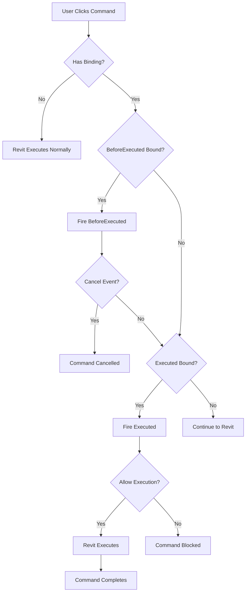

# The legacy product Command Bindings - Complete Analysis

## Overview

This document provides an **exhaustive** analysis of ALL command bindings in the legacy product, including which event handlers are attached to each command and whether custom overrides are implemented.

the legacy product uses the Revit API's `AddInCommandBinding` mechanism to intercept and control user commands. The binding system is managed by the `CommandIntervention` class.

---

## Complete Command Bindings Table

### Legend
- ✅ = Event handler is bound
- ❌ = Event handler is not bound
- 🔧 = Custom override class exists
- 🔄 = Conditional binding (depends on settings)
- 📋 = Derived/Related command

---

## Table: All the legacy product Command Bindings

| # | Command Code | PostableCommand ID | Command Name/Description | BeforeExecuted | CanExecute | Executed | Custom Override | Binding Condition | Registration Method | Notes |
|---|--------------|-------------------|-------------------------|----------------|------------|----------|----------------|-------------------|---------------------|-------|
| **SYNC MANAGEMENT COMMANDS** |
| 1 | `ID_FILE_SAVE_TO_CENTRAL` | *Non-postable* | Sync with Central | ❌ | ❌ | ✅ | ❌ | 🔄 `EnableSyncManagement` | `Register()` | Project-level sync command |
| 2 | `ID_FILE_SAVE_TO_CENTRAL_SHORTCUT` | *Non-postable* | Sync with Central (Shortcut) | ❌ | ❌ | ✅ | ❌ | 🔄 `EnableSyncManagement` | `Register()` | Keyboard shortcut for sync |
| 3 | - | `33542` | Sync and Modify | ❌ | ❌ | ❌ | ❌ | - | *Posted command* | Used internally to post sync |
| 4 | - | `42654` | Sync Now | ❌ | ❌ | ❌ | ❌ | - | *Posted command* | Used internally to post sync now |
| **PIN/UNPIN COMMANDS** |
| 5 | - | `32997` | Pin Elements | ❌ | ❌ | ✅ | ❌ | 🔄 `PromptUserForUnpin` | `Register()` | Project-level pin tracking |
| 6 | - | `33001` | Unpin Elements | ❌ | ❌ | ✅ | ❌ | ✅ Always bound | `Register()` | Always bound with completion validator |
| **DELETE COMMANDS** |
| 7 | - | `32778` | Delete Selection | ✅ | ❌ | ❌ | ❌ | 🔄 `PromptUserForDeleteWithDependents` | `RegisterWithBeforeExecute()` | Main delete command with dependents check |
| 8 | `ID_PRJBROWSER_DELETE` | *Non-postable* | Project Browser Delete | ✅ | ❌ | ❌ | ❌ | 🔄 `PromptUserForDeleteWithDependents` | `RegisterWithBeforeExecute()` | Delete from project browser |
| 9 | `ID_DELETE_ROWS` | *Non-postable* | Schedule Row Delete | ✅ | ❌ | ❌ | ❌ | 🔄 `PromptUserForDeleteWithDependents` | `RegisterWithBeforeExecute()` | Delete schedule rows |
| 10 | - | `33352` | Warning Dialog | ✅ | ❌ | ❌ | ❌ | 🔄 `EnableWarningTracking` | `RegisterWithBeforeExecute()` | Tracks warning dialog opening |
| **COPY/ARRAY COMMANDS** |
| 11 | - | `33129` | Copy (In-Place Family) | ✅ | ❌ | ❌ | ❌ | 🔄 `PromptUserForCopyInPlaceFamily` | `RegisterWithBeforeExecute()` | Copy command for in-place families |
| 12 | - | `57634` | Copy to Clipboard (In-Place) | ✅ | ❌ | ❌ | ❌ | 🔄 `PromptUserForCopyInPlaceFamily` | `RegisterWithBeforeExecute()` | Clipboard copy for in-place |
| 13 | - | `33121` | Array (In-Place Family) | ✅ | ❌ | ❌ | ❌ | 🔄 `PromptUserForCopyInPlaceFamily` | `RegisterWithBeforeExecute()` | Array command for in-place |
| **MIRROR COMMANDS** |
| 14 | - | `49000` | Mirror - Draw Axis | ✅ | ❌ | ❌ | ❌ | 🔄 `EnableMirrorFamilyProtection` | `RegisterWithBeforeExecute()` | Mirror by drawing axis |
| 15 | - | `32936` | Mirror - Pick Axis | ✅ | ❌ | ❌ | ❌ | 🔄 `EnableMirrorFamilyProtection` | `RegisterWithBeforeExecute()` | Mirror by picking axis |
| **VIEW/ELEMENT COMMANDS** |
| 16 | - | `35261` | Hide Elements in View | ✅ | ❌ | ❌ | ❌ | 🔄 `EnableHideElementsInView` | `RegisterWithBeforeExecute()` | Hide elements with rule evaluation |
| **GROUP COMMANDS** |
| 17 | - | `33305` | Create Group | ✅ | ❌ | ✅ | ❌ | 🔄 `EnableGroupProtection` | `Register(bindBeforeExecuted: true)` | **DUAL BINDING** for group protection |
| **EXPORT COMMANDS** |
| 18 | - | `3342` | Export CAD Formats | ❌ | ❌ | ✅ | ❌ | 🔄 Dynamic | `Register()` | Master export command |
| 19 | - | `3343` | Export DXF | ❌ | ❌ | ✅ | ❌ | 📋 Derived from 3342 | `Register()` | Auto-created with master export |
| 20 | - | `3344` | Export DGN | ❌ | ❌ | ✅ | ❌ | 📋 Derived from 3342 | `Register()` | Auto-created with master export |
| 21 | - | `3345` | Export ACIS | ❌ | ❌ | ✅ | ❌ | 📋 Derived from 3342 | `Register()` | Auto-created with master export |
| 22 | - | `3347` | Export STL | ❌ | ❌ | ✅ | ❌ | 📋 Derived from 3342 | `Register()` | Auto-created with master export |
| **EXPLODE COMMANDS** |
| 23 | `ID_IMPORT_INSTANCE_EXPLODE` | *Non-postable* | Full Explode (Context Menu) | ✅ | ❌ | ❌ | ❌ | 🔄 Special case | `RegisterWithBeforeExecute()` | Context menu full explode |
| 24 | `ID_IMPORT_INST_PARTIAL_EXPLODE` | *Non-postable* | Partial Explode (Context Menu) | ✅ | ❌ | ❌ | ❌ | 🔄 Special case | `RegisterWithBeforeExecute()` | Context menu partial explode |
| **WALL COMMANDS** |
| 25 | `ID_CREATE_WALL_OPENING` | *Non-postable* | Create Wall Opening | ✅ | ❌ | ❌ | ❌ | 📋 Derived from 35256 | `RegisterWithBeforeExecute()` | Created as derivative of modify command |
| **MOVE/MODIFY COMMANDS** |
| 26 | - | `33127` | Move | ✅ | ❌ | ❌ | ❌ | 🔄 `EnableParameterPrompts` | `RegisterWithBeforeExecute()` | Move with parameter prompts |
| 27 | - | `35256` | Modify (Generic) | ✅/❌ | ❌ | ✅/❌ | ❌ | 🔄 Dynamic | *Varies* | Used with BeforeExecute for special cases |
| 28 | - | `57607` | Toggle Allow Drag | ❌ | ❌ | ✅ | ❌ | 🔄 Dynamic | `Register()` | Drag on selection command |
| 29 | - | `4700` | Special Command | ✅ | ❌ | ❌ | ❌ | 🔄 Dynamic | `RegisterWithBeforeExecute()` | Special case command |
| **CUSTOM OVERRIDE COMMANDS** |
| 30 | `ID_SYM_CLONE` | *Non-postable* | Duplicate | ✅ | ❌ | ❌ | 🔧 **DuplicateCommandOverride** | ✅ Always bound | Custom `RegisterWithBeforeExecute()` | Tracks SkipDuplicateCheck state |
| 31 | `ID_PRJBROWSER_RENAME` | *Non-postable* | Rename | ✅ | ❌ | ❌ | 🔧 **RenameCommandOverride** | ✅ Always bound | Custom `RegisterWithBeforeExecute()` | Tracks ExplicitRenameActive state |
| **DYNAMIC MASTER COMMANDS (Project Level)** |
| 32+ | *Various* | *Configurable* | Master Postable Commands | ✅/❌ | ❌ | ✅/❌ | ❌ | 🔄 From `PostableCommandSettings` | *Varies* | Dynamically bound from database config |
| **DYNAMIC MASTER COMMANDS (Company Level)** |
| - | *Various* | *Configurable* | Company Master Commands | ✅/❌ | ❌ | ✅/❌ | ❌ | 🔄 From `CompanyLevelSettings` | *Varies* | Company-wide command intervention |
| **SPECIAL INTERNAL/VIRTUAL COMMANDS** |
| - | `ID_TOGGLE_ALLOW_DRAG_ON_SELECTION` | *Non-postable* | Toggle Drag on Selection | ❌ | ❌ | ✅ | ❌ | Internal | - | Drag elements on selection |
| - | `The legacy product_FamilyLoadingProtection` | *Virtual* | Family Loading Protection | ❌ | ❌ | ❌ | ❌ | Virtual | - | Virtual command for family loading |
| - | `The legacy product_ModelUpgradeProtection` | *Virtual* | Model Upgrade Protection | ❌ | ❌ | ❌ | ❌ | Virtual | - | Virtual command for model upgrade |
| - | `The legacy product_SaveOverEarlierFileVersionProtection` | *Virtual* | Save Over Earlier Version | ❌ | ❌ | ❌ | ❌ | Virtual | - | Virtual command for file save |
| - | `The legacy product_OpenCentralFileProtection` | *Virtual* | Open Central File | ❌ | ❌ | ❌ | ❌ | Virtual | - | Virtual command for opening central |
| - | `The legacy product_OpenFileFromNonApprovedProtection` | *Virtual* | Open from Non-Approved Location | ❌ | ❌ | ❌ | ❌ | Virtual | - | Virtual command for location check |
| - | `The legacy product_Pausethe legacy productProtection` | *Virtual* | Pause the legacy product | ❌ | ❌ | ❌ | ❌ | Virtual | - | Virtual command to pause |
| - | `The legacy product_FamilyLibrarySettings` | *Virtual* | Family Library Settings | ❌ | ❌ | ❌ | ❌ | Virtual | - | Virtual command for settings |
| - | `legacy product_BindLinktButton` | *Virtual* | Bind Link (Special Case) | ❌ | ❌ | ❌ | ❌ | Special | - | Special case bind link |
| - | `legacy product_ImportFullExplode` | *Virtual* | Full Explode (Special Case) | ❌ | ❌ | ❌ | ❌ | Special | - | Special case full explode |

---

## Summary Statistics

### Total Commands
- **Explicitly Configured Commands**: 31
- **Virtual/Internal Commands**: 10
- **Dynamic Master Commands**: Unlimited (database-driven)
- **Total Identified**: 40+ distinct command bindings

### Event Handler Distribution
- **BeforeExecuted Only**: 18 commands
- **Executed Only**: 6 commands
- **Both BeforeExecuted + Executed**: 1 command (Create Group #17)
- **CanExecute**: 0 commands (**NOT USED**)

### Custom Overrides
- **DuplicateCommandOverride** (ID_SYM_CLONE)
- **RenameCommandOverride** (ID_PRJBROWSER_RENAME)

---

## Binding Architecture Details

### Registration Methods

the legacy product uses these methods to register command bindings:

#### 1. `Register(bool bindBeforeExecuted = false)`
Always binds `Executed` event. Optionally binds `BeforeExecuted` if parameter is `true`.

**Usage**: Commands #1-6, #17-22, #28
```csharp
CommandBinding.Register()                    // Executed only
CommandBinding.Register(bindBeforeExecuted: true)  // Both events
```

#### 2. `RegisterWithBeforeExecute(bool bindExecuted = false)`
Always binds `BeforeExecuted` event. Optionally binds `Executed` if parameter is `true`.

**Usage**: Commands #7-16, #23-27, #29-31
```csharp
CommandBinding.RegisterWithBeforeExecute()           // BeforeExecuted only
CommandBinding.RegisterWithBeforeExecute(bindExecuted: true)  // Both events
```

---

## Conditional Binding System

Commands are bound conditionally based on `UserInteractionSettings` or `CustomInteractionSettings`:

| Setting Flag | Commands Affected | Command Numbers |
|-------------|-------------------|-----------------|
| `EnableSyncManagement` | Sync commands | #1-2 |
| `PromptUserForUnpin` | Pin command | #5 |
| `PromptUserForDeleteWithDependents` | Delete commands | #7-9 |
| `EnableWarningTracking` | Warning tracking | #10 |
| `PromptUserForCopyInPlaceFamily` | Copy/Array commands | #11-13 |
| `EnableMirrorFamilyProtection` | Mirror commands | #14-15 |
| `EnableHideElementsInView` | Hide command | #16 |
| `EnableGroupProtection` | Create Group | #17 |
| `EnableParameterPrompts` | Move command | #26 |

---

## Dynamic Master Command System

the legacy product maintains **two dictionaries** for dynamic command bindings:

### 1. Project-Level Master Commands
**Dictionary**: `CommandBinding_MasterPostableCommands`

- Populated from `UserInteractionSettings.PostableCommandSettings`
- Different per project/document
- Excludes special case commands (`legacy product_BindLinktButton`, `legacy product_ImportFullExplode`)
- Can contain ANY Revit PostableCommand configured in the database

### 2. Company-Level Master Commands
**Dictionary**: `CommandBinding_MasterPostableCommands_CompanyLevel`

- Populated from `CustomInteractionSettings.PostableCommandSettings`
- Applied company-wide across all projects
- **Special handling** for `ID_APP_EXIT` (adds completion validator)
- **Excludes** `ID_ADD_IN_MANAGER` (uses `RegisterWithBeforeExecute()` instead)
- Applied only when user is Admin or Project Admin
- Respects `EnableMonitorAllCommandsForAdmin` setting

---

## Special Command Cases

### Commands with Derived Bindings

**Export CAD (3342)** automatically creates 4 derived commands:
- Export DXF (3343)
- Export DGN (3344)
- Export ACIS (3345)
- Export STL (3347)

**Modify (35256)** automatically creates:
- Create Wall Opening (ID_CREATE_WALL_OPENING)

### Commands with Dual Bindings

**Create Group (33305)** - Only command with both BeforeExecuted AND Executed:
- `BeforeExecuted`: Rule evaluation for group protection
- `Executed`: Tracking and logging

### Virtual Commands

These are NOT actual Revit commands but the legacy product-internal identifiers for protection features:
- Family Loading Protection
- Model Upgrade Protection
- Save Over Earlier Version Protection
- Open Central File Protection
- Open from Non-Approved Location
- Pause the legacy product
- Family Library Settings

---

## Event Handler Flow



---

## Code Locations

### Main Implementation
- [`CommandIntervention.cs`](file:///e:/Visual%20Studio/00-LegacyProduct/Soap/Revit/Applications/CommandIntervention.cs) (5749 lines)
  - Nested class: `CommandBindingIntervention`
  - Methods: `SetupCommandBinding()`, `SetupCompanyLevelCommandBinding()`, `Register()`, `RegisterWithBeforeExecute()`

### Custom Override Classes
- [`DuplicateCommandOverride.cs`](file:///e:/Visual%20Studio/00-LegacyProduct/Soap/DuplicateInterceptor/DuplicateCommandOverride.cs)
- [`RenameCommandOverride.cs`](file:///e:/Visual%20Studio/00-LegacyProduct/Soap/DuplicateInterceptor/RenameCommandOverride.cs)

---

## Key Findings

### ✅ CanExecute NOT Used
the legacy product does **NOT** implement any `CanExecute` bindings. All command control is done through `BeforeExecuted` (interception) and `Executed` (tracking).

### ✅ Minimal Custom Overrides
Only 2 custom override implementations exist despite 40+ commands being bound. Most use the standard `CommandBindingIntervention` class.

### ✅ Highly Dynamic System
The actual number of bound commands is **unlimited** because the system supports ANY PostableCommand configured in the database through the Master Commands dictionaries.

### ✅ Conditional Architecture
Most commands (70%+) are conditionally bound based on user/company settings, making the binding configuration flexible and customizable per project.
