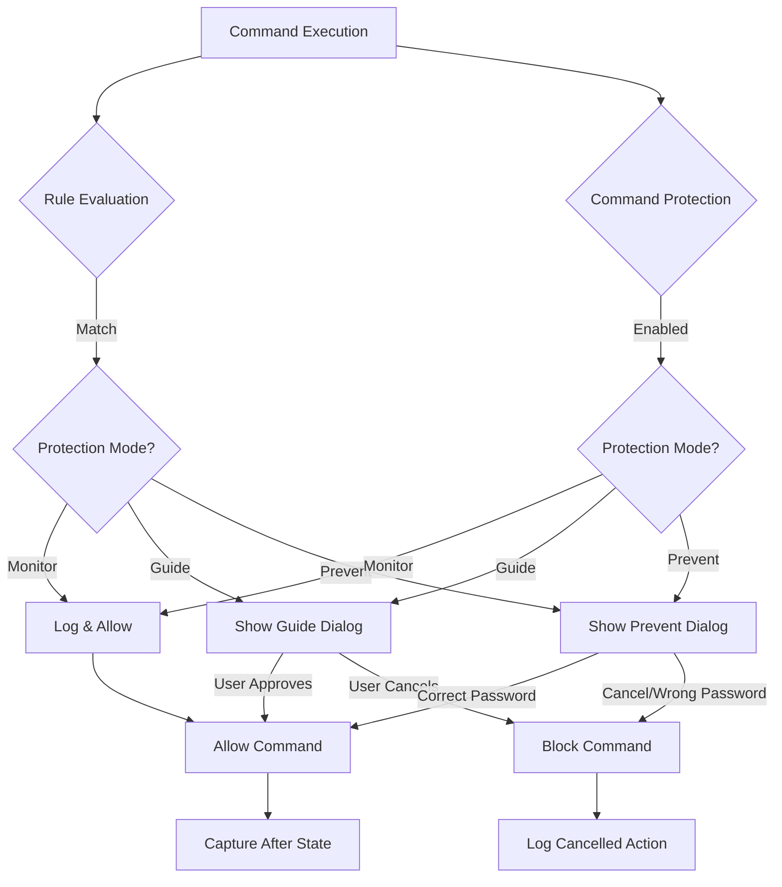

# Protection Modes & Intervention Framework

## Overview

Implement complete protection mode infrastructure for both rule-based protection (RuleCommandInterceptor) and command-based protection (CommandProtectionService), with WPF dialogs for Guide/Prevent modes and password-protected overrides.

## Architecture

## Implementation Plan

### Phase 1: Core Infrastructure (Foundation)

**1.1 Create Protection Mode Data Models**

- Create [`BIManage/Core/Protection/Models/ProtectionSettings.cs`](BIManage/Core/Protection/Models/ProtectionSettings.cs)
  - `ProtectionSettings` class with password storage (encrypted)
  - `ProtectionAuditEntry` class for logging
  - `AdminCredentials` class for password management

**1.2 Create WPF Dialog Base Classes**

- Create [`BIManage/Views/Protection/ProtectionDialogBase.xaml`](BIManage/Views/Protection/ProtectionDialogBase.xaml)
  - Base class for all protection dialogs
  - Common styling and layout
  - Rule details display section
- Create [`BIManage/ViewModels/Protection/ProtectionDialogBaseViewModel.cs`](BIManage/ViewModels/Protection/ProtectionDialogBaseViewModel.cs)
  - Base ViewModel with common properties
  - Element details, rule information
  - Uses `CommunityToolkit.Mvvm.ComponentModel.ObservableObject`

### Phase 2: Monitor Mode (Passive Tracking)

**2.1 Enhance Monitor Mode in RuleCommandInterceptor**

- Update [`BIManage/Revit/Commands/RuleCommandInterceptor.cs`](BIManage/Revit/Commands/RuleCommandInterceptor.cs)
  - `HandleMonitorMode()` method
  - Log to file with structured data
  - Prepare for future database logging
  - Capture before/after screenshots (placeholder for future)

**2.2 Create Monitor Mode Audit Repository**

- Create [`BIManage/Data/SQLite/AuditRepository.cs`](BIManage/Data/SQLite/AuditRepository.cs)
  - `SaveAuditEntry()` for Monitor mode logging
  - Schema for audit_log table
  - Batch insert for performance

**2.3 Update Schema for Audit Logging**

- Update [`BIManage/Data/SQLite/Schema.sql`](BIManage/Data/SQLite/Schema.sql)
  - Add `audit_log` table
  - Columns: id, timestamp, user, rule_id, command_id, mode, action (allowed/blocked), element_ids, reason

### Phase 3: Guide Mode (Modal WPF Dialogs)

**3.1 Create Guide Mode WPF Dialog**

- Create [`BIManage/Views/Protection/GuideDialog.xaml`](BIManage/Views/Protection/GuideDialog.xaml)
  - Modal dialog with rule violation details
  - Element summary (category, type, count)
  - Matched rules list with icons
  - "Proceed" and "Cancel" buttons
  - Optional comment textbox (if `RequireComment` is true)
- Create [`BIManage/Views/Protection/GuideDialog.xaml.cs`](BIManage/Views/Protection/GuideDialog.xaml.cs)
  - Code-behind for dialog initialization

**3.2 Create Guide Mode ViewModel**

- Create [`BIManage/ViewModels/Protection/GuideDialogViewModel.cs`](BIManage/ViewModels/Protection/GuideDialogViewModel.cs)
  - Properties: `RuleEvaluationResult`, `Elements`, `UserComment`
  - Commands: `ProceedCommand`, `CancelCommand`
  - Result property to return user decision

**3.3 Integrate Guide Dialog into RuleCommandInterceptor**

- Update [`BIManage/Revit/Commands/RuleCommandInterceptor.cs`](BIManage/Revit/Commands/RuleCommandInterceptor.cs)
  - Replace `ShowGuideDialog()` TaskDialog with WPF dialog
  - Pass `RuleEvaluationResult` and selected elements
  - Capture user comment if required
  - Return true/false for user decision

**3.4 Integrate Guide Dialog into CommandInterventionHandler**

- Update [`BIManage/Revit/Protection/CommandInterventionHandler.cs`](BIManage/Revit/Protection/CommandInterventionHandler.cs)
  - `ProcessGuideMode()` uses WPF GuideDialog
  - Handle command-based protection settings

### Phase 4: Prevent Mode (Password-Protected Dialogs)

**4.1 Create Password Management Service**

- Create [`BIManage/Core/Protection/PasswordManager.cs`](BIManage/Core/Protection/PasswordManager.cs)
  - Store encrypted password in SQLite
  - `ValidatePassword()` method
  - `SetPassword()` method (for configuration)
  - Use `System.Security.Cryptography` for hashing

**4.2 Create Prevent Mode WPF Dialog**

- Create [`BIManage/Views/Protection/PreventDialog.xaml`](BIManage/Views/Protection/PreventDialog.xaml)
  - Modal dialog with rule violation details
  - Element summary and matched rules
  - PasswordBox for override password
  - "Override" and "Cancel" buttons
  - Warning message about blocked action
- Create [`BIManage/Views/Protection/PreventDialog.xaml.cs`](BIManage/Views/Protection/PreventDialog.xaml.cs)
  - Code-behind for password validation

**4.3 Create Prevent Mode ViewModel**

- Create [`BIManage/ViewModels/Protection/PreventDialogViewModel.cs`](BIManage/ViewModels/Protection/PreventDialogViewModel.cs)
  - Properties: `RuleEvaluationResult`, `Elements`, `Password`
  - Commands: `OverrideCommand`, `CancelCommand`
  - `ValidatePassword()` using PasswordManager
  - Result property (allowed/blocked)

**4.4 Integrate Prevent Dialog into RuleCommandInterceptor**

- Update [`BIManage/Revit/Commands/RuleCommandInterceptor.cs`](BIManage/Revit/Commands/RuleCommandInterceptor.cs)
  - Replace `ShowPreventDialog()` TaskDialog with WPF dialog
  - Handle password validation result
  - Always block if password is wrong or cancelled

**4.5 Integrate Prevent Dialog into CommandInterventionHandler**

- Update [`BIManage/Revit/Protection/CommandInterventionHandler.cs`](BIManage/Revit/Protection/CommandInterventionHandler.cs)
  - `ProcessPreventMode()` uses WPF PreventDialog
  - Handle password override for command-based protection

### Phase 5: Password Configuration & Settings

**5.1 Update SQLite Schema for Password Storage**

- Update [`BIManage/Data/SQLite/Schema.sql`](BIManage/Data/SQLite/Schema.sql)
  - Add `protection_passwords` table
  - Columns: id, password_hash, salt, created_date, updated_date

**5.2 Create Password Configuration Command**

- Create [`BIManage/Commands/RibbonCommands/ConfigurePasswordCommand.cs`](BIManage/Commands/RibbonCommands/ConfigurePasswordCommand.cs)
  - External command to set/change override password
  - Shows password configuration dialog
  - Conditional on `DeveloperTools` feature flag

**5.3 Create Password Configuration Dialog**

- Create [`BIManage/Views/Protection/PasswordConfigDialog.xaml`](BIManage/Views/Protection/PasswordConfigDialog.xaml)
  - Current password (if exists)
  - New password
  - Confirm password
  - Strength indicator
- Create [`BIManage/ViewModels/Protection/PasswordConfigViewModel.cs`](BIManage/ViewModels/Protection/PasswordConfigViewModel.cs)
  - Password validation logic
  - Save to PasswordManager

### Phase 6: Audit Logging Enhancement

**6.1 Create Comprehensive Audit Service**

- Create [`BIManage/Core/Protection/AuditService.cs`](BIManage/Core/Protection/AuditService.cs)
  - `LogMonitorAction()` - passive tracking
  - `LogGuideAction()` - user decision (proceed/cancel)
  - `LogPreventAction()` - blocked/override
  - Includes element details, user, timestamp, rule info

**6.2 Integrate Audit Service**

- Update [`BIManage/Revit/Commands/RuleCommandInterceptor.cs`](BIManage/Revit/Commands/RuleCommandInterceptor.cs)
  - Call AuditService after each mode handler
  - Log in OnExecuted for successful commands
- Update [`BIManage/Revit/Protection/CommandInterventionHandler.cs`](BIManage/Revit/Protection/CommandInterventionHandler.cs)
  - Call AuditService for command-based protection

**6.3 Register Services in Dependency Injection**

- Update [`BIManage/Revit/Applications/RevitBootstrapper.cs`](BIManage/Revit/Applications/RevitBootstrapper.cs)
  - Register `PasswordManager` as singleton
  - Register `AuditService` as singleton
  - Initialize password from database

### Phase 7: Testing & Feature Flags

**7.1 Enable Protection Modes Feature Flag**

- Update [`BIManage/Core/Features/FeatureToggleService.cs`](BIManage/Core/Features/FeatureToggleService.cs)
  - Change `SetFeatureEnabled("ProtectionModes", true);`
  - Add `SetFeatureEnabled("PasswordProtection", true);`

**7.2 Create Manual Testing Command**

- Update [`BIManage/Commands/RibbonCommands/TestRulesCommand.cs`](BIManage/Commands/RibbonCommands/TestRulesCommand.cs)
  - Add mode-specific testing options
  - Test Monitor, Guide, Prevent modes separately

**7.3 Create Sample Rules for Each Mode**

- Create [`BIManage/Rules/Samples/mode-testing.json`](BIManage/Rules/Samples/mode-testing.json)
  - Sample Monitor rule (logs only)
  - Sample Guide rule (user choice)
  - Sample Prevent rule (password required)

## Key Files to Create/Update

### New Files (17):

1. `BIManage/Core/Protection/Models/ProtectionSettings.cs`
2. `BIManage/Core/Protection/PasswordManager.cs`
3. `BIManage/Core/Protection/AuditService.cs`
4. `BIManage/Data/SQLite/AuditRepository.cs`
5. `BIManage/Views/Protection/ProtectionDialogBase.xaml`
6. `BIManage/Views/Protection/ProtectionDialogBase.xaml.cs`
7. `BIManage/Views/Protection/GuideDialog.xaml`
8. `BIManage/Views/Protection/GuideDialog.xaml.cs`
9. `BIManage/Views/Protection/PreventDialog.xaml`
10. `BIManage/Views/Protection/PreventDialog.xaml.cs`
11. `BIManage/Views/Protection/PasswordConfigDialog.xaml`
12. `BIManage/Views/Protection/PasswordConfigDialog.xaml.cs`
13. `BIManage/ViewModels/Protection/ProtectionDialogBaseViewModel.cs`
14. `BIManage/ViewModels/Protection/GuideDialogViewModel.cs`
15. `BIManage/ViewModels/Protection/PreventDialogViewModel.cs`
16. `BIManage/ViewModels/Protection/PasswordConfigViewModel.cs`
17. `BIManage/Commands/RibbonCommands/ConfigurePasswordCommand.cs`

### Updated Files (8):

1. `BIManage/Revit/Commands/RuleCommandInterceptor.cs`
2. `BIManage/Revit/Protection/CommandInterventionHandler.cs`
3. `BIManage/Data/SQLite/Schema.sql`
4. `BIManage/Revit/Applications/RevitBootstrapper.cs`
5. `BIManage/Core/Features/FeatureToggleService.cs`
6. `BIManage/Commands/RibbonCommands/TestRulesCommand.cs`
7. `BIManage/Revit/Applications/Application.cs` (add password config button)
8. `BIManage/Rules/Samples/mode-testing.json` (new file)

## Design Decisions

**1. Two Parallel Protection Systems:**

- Rule-based protection (RuleCommandInterceptor + RuleService) - element-aware
- Command-based protection (CommandProtectionService) - command-aware
- Both systems share the same WPF dialogs

**2. Password Storage:**

- Encrypted using PBKDF2 with salt
- Stored in SQLite `protection_passwords` table
- No backend dependency for Phase 1

**3. Modal Dialogs:**

- All dialogs are modal (block workflow)
- Use `ShowDialog()` method
- User must respond before proceeding

**4. Audit Logging:**

- All actions logged to SQLite
- Includes Monitor (passive), Guide (user choice), Prevent (block/override)
- Future: Sync to backend API

## Testing Strategy

1. Test Monitor mode: Verify logging without blocking
2. Test Guide mode: Verify user can choose proceed/cancel
3. Test Prevent mode: Verify password protection works
4. Test wrong password: Verify command is blocked
5. Test with multiple rules: Verify highest mode wins (Prevent > Guide > Monitor)