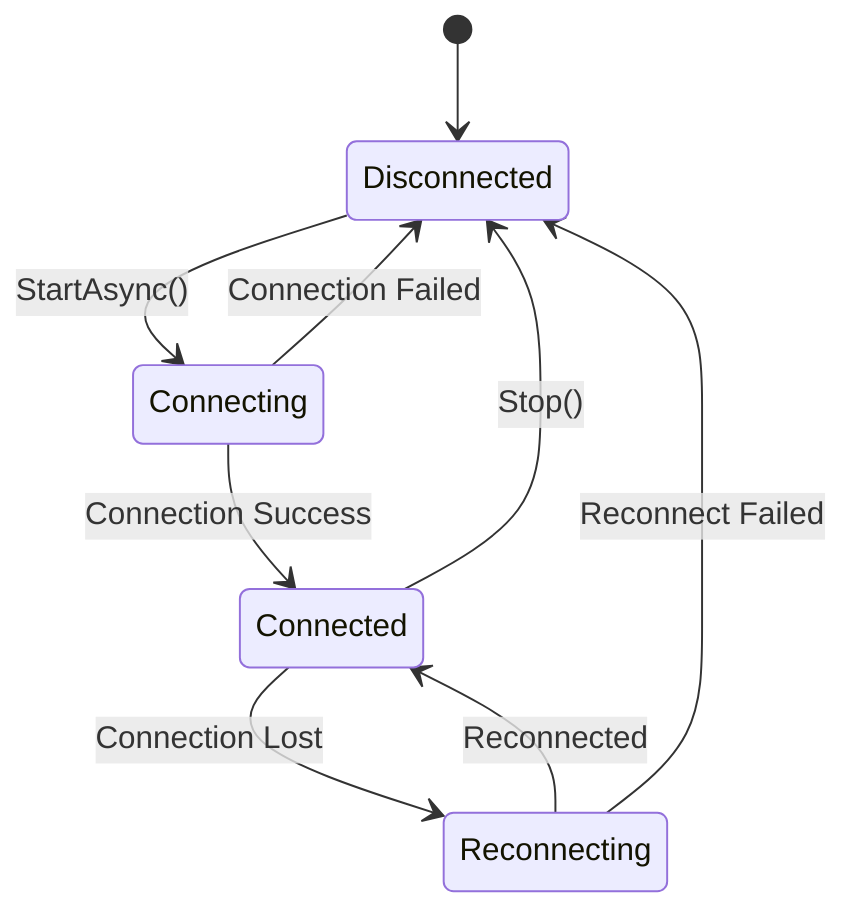

# The legacy product SignalR Technology Analysis

This document provides a comprehensive analysis of the SignalR real-time communication implementation in the legacy product application, designed to help replicate this pattern in other applications.

---

## Overview

The legacy product uses **Microsoft ASP.NET SignalR Client 2.4.3** for real-time bidirectional communication between the Revit client application and the cloud server. The implementation follows a hub-based architecture with group subscriptions for multi-user collaboration scenarios.

### Technology Stack
- **Library**: `Microsoft.AspNet.SignalR.Client` (v2.4.3.0)
- **Hub Name**: `NotificationHub`
- **Base URL**: Retrieved from `SoapAPIAppHelper.GetSoapBaseURL()`
- **Host**: `legacy-signalr-defaultmode-prod.service.signalr.net`
- **Transport**: WebSocket-based with fallback support

---

## Architecture Components

### 1. Core Service Layer

#### **SignalRService** ([SignalRService.cs](file:///e:/Visual%20Studio/00-LegacyProduct/Soap/SignalR/SignalRService.cs))

The central service managing the SignalR connection lifecycle.

**Key Responsibilities:**
- Establishing and maintaining hub connections
- Automatic reconnection with exponential backoff
- Group subscription management
- Connection state monitoring

**Critical Properties:**
```csharp
private HubConnection connection;
private IHubProxy hubProxy;
private bool _connecting;
bool IsConnected { get; }
```

**Connection Lifecycle:**
1. `EnsureHubConnection()` - Creates `HubConnection` with query string parameters (companyId, user)
2. `EnsureHubProxy()` - Creates hub proxy for "NotificationHub"
3. `EnsureHubSubscribesToGroupMessageEvent()` - Subscribes to "GroupMessage" event
4. `StartAsync()` - Initiates connection with retry logic
5. Event handlers for connection state changes

**Connection Parameters:**
```csharp
new HubConnection(SOAPAPI_BASE_URL, 
    $"companyId={SoapAPIAppHelper.Instance.CompanyId}&user={SoapAPIAppHelper.Instance.Username}")
```

**Reconnection Strategy:**
- Auto-reconnect on disconnection
- Random delay between 10-20 seconds (`RECONNECT_DELAY_MIN` to `RECONNECT_DELAY_MAX`)
- Internet connectivity check before reconnect attempt
- Version conflict detection

#### **SignalRConnectionManager** ([SignalRConnectionManager.cs](file:///e:/Visual%20Studio/00-LegacyProduct/Soap/SignalR/SignalRConnectionManager.cs))

Singleton manager coordinating multiple listeners and their group subscriptions.

**Key Responsibilities:**
- Managing multiple `ISignalListener` instances
- Coordinating group subscriptions across listeners
- Starting/stopping the SignalR service based on listener count
- Logging connection events

**Pattern:**
```csharp
public class SignalRConnectionManager
{
    private static SignalRConnectionManager _instance;
    public static SignalRConnectionManager Instance { get; }
    
    public ObservableCollection<ISignalListener> Listeners { get; set; }
    public static SignalRService SignalRService { get; set; }
    
    public void AddListener(ISignalListener listener, OperationTracker ot)
    public void RemoveListener(ISignalListener listener, OperationTracker ot)
    public Task SubscribeToGroup(string groupName, OperationTracker ot)
    public Task UnsubscribeToGroup(string groupName, OperationTracker ot)
}
```

**Lifecycle Logic:**
- When first listener added → Start SignalR connection
- When last listener removed → Stop SignalR connection
- Automatically resubscribe to all groups on reconnection

---

### 2. Listener Pattern

#### **ISignalListener** Interface ([ISignalListener.cs](file:///e:/Visual%20Studio/00-LegacyProduct/Soap/SignalR/ISignalListener.cs))

Defines the contract for components that want to receive SignalR messages.

#### **SignalListener** Implementation ([SignalListener.cs](file:///e:/Visual%20Studio/00-LegacyProduct/Soap/SignalR/SignalListener.cs))

Base implementation with group subscription management.

**Key Features:**
```csharp
public class SignalListener : NotifyPropertyBase, ISignalListener, IDisposable
{
    public string Name { get; set; }
    public ObservableCollection<string> GroupNames { get; set; }
    public event SignalRDataReceivedHandler SignalRDataReceived;
    
    public static SignalListener Create(string name, OperationTracker ot)
    public void SubscribeToGroup(string groupName, OperationTracker ot)
    public void UnSubscribeToGroup(string groupName, OperationTracker ot)
    public void DataReceivedAggregator(SignalRMessageInfo data)
}
```

**Usage Pattern:**
```csharp
// Create listener
var listener = SignalListener.Create("MyListener", ot);
listener.SignalRDataReceived += OnSignalRDataReceived;

// Subscribe to groups
listener.SubscribeToGroup(groupName, ot);

// Handle messages
void OnSignalRDataReceived(SignalRMessageInfo data, OperationTracker ot, bool isSimulated)
{
    var messageType = data.GetMessageType();
    var payload = ((JToken)(data.Data as JObject)).ToObject(messageType);
    // Process payload
}

// Cleanup
listener.Dispose();
```

---

### 3. Message System

#### **SignalRMessageInfo** ([SignalRMessageInfo.cs](file:///e:/Visual%20Studio/00-LegacyProduct/Soap/SignalR/SignalRMessageInfo.cs))

Wrapper for all SignalR messages.

```csharp
public class SignalRMessageInfo
{
    public object Data { get; set; }
    public int MessageType { get; set; }
    
    public Type GetMessageType()
    {
        // Maps MessageType enum to actual Type
    }
}
```

#### **SignalRMessageType** Enum ([SignalRMessageType.cs](file:///e:/Visual%20Studio/00-LegacyProduct/SoapAPI/Model/SignalR/SignalRMessageType.cs))

Defines all message types:

| Type | Value | Purpose |
|------|-------|---------|
| `ActivityFeed` | 101 | User activity notifications |
| `ProjectSession` | 102 | Active user sessions |
| `SyncTraffic` | 103 | Sync coordination messages |
| `ProjectConfigSave` | 104 | Project configuration updates |
| `ProjectSettings` | 105 | Project settings changes |
| `SettingsReconnect` | 106 | Settings sync on reconnect |
| `ProjectValues` | 107 | Project values updates |
| `BroadcastMessage` | 108 | General broadcast messages |

---

### 4. Event Distribution Pattern

#### **SignalRMessageInfoReceivedEvent** ([SignalRMessageInfoReceivedEvent.cs](file:///e:/Visual%20Studio/00-LegacyProduct/Soap/Events/SignalR/SignalRMessageInfoReceivedEvent.cs))

Prism event for distributing SignalR messages to all interested components.

```csharp
public class SignalRMessageInfoReceivedEvent : PubSubEvent<SignalRMessageInfo> { }
```

**Flow:**
1. SignalR receives "GroupMessage" event
2. Deserialize to `SignalRMessageInfo`
3. Publish via EventAggregator: `SoapApplication.EventAggregator.GetEvent<SignalRMessageInfoReceivedEvent>().Publish(signalRMessageInfo)`
4. All listeners receive message via `DataReceivedAggregator`

#### **ProjectCentralSignalRDataDistributor** ([ProjectCentralSignalRDataDistributor.cs](file:///e:/Visual%20Studio/00-LegacyProduct/Soap/Events/ProjectCentral/ProjectCentralSignalRDataDistributor.cs))

Re-publishes typed messages to specific events.

```csharp
public static void Distribute(object data)
{
    if (data is ActivityFeed payload)
        SoapApplication.EventAggregator.GetEvent<ActivityFeedReceivedEvent>().Publish(payload);
    if (data is ProjectSession payload)
        SoapApplication.EventAggregator.GetEvent<ProjectSessionReceivedEvent>().Publish(payload);
}
```

---

### 5. Group Management

#### **SignalRGroupHelper** ([SignalRGroupHelper.cs](file:///e:/Visual%20Studio/00-LegacyProduct/SoapAPI/SignalR/SignalRGroupHelper.cs))

Utility class for generating consistent group names.

**Group Name Patterns:**

```csharp
// Project Central
GetGroupName_forProjectCentralAdmins(licenseGuid, projectGuid)
  → "ProjectCentralAdmin-{licenseGuid}-{projectGuid}"

GetGroupName_forProjectCentralUsers(licenseGuid, projectGuid)
  → "ProjectCentralUser-{licenseGuid}-{projectGuid}"

// Sync Traffic
GetGroupName_forProjectSyncTrafficAdmins(licenseGuid, projectGuid)
  → "ProjectSyncTrafficAdmin-{licenseGuid}-{projectGuid}"

GetGroupName_forProjectSyncTrafficUser(licenseGuid, projectGuid)
  → "ProjectSyncTrafficUser-{licenseGuid}-{projectGuid}"

// Project Config
GetGroupName_forProjectConfigAdmins(licenseGuid)
  → "ProjectConfigAdmin-{licenseGuid}"

GetGroupName_forProjectConfigUser(licenseGuid)
  → "ProjectConfigUser-{licenseGuid}"

// Messaging
GetGroupName_ForMessaging_Company(companyLicenseGuid)
  → "Messaging-{companyLicenseGuid}"

GetGroupName_ForMessaging_Project(companyLicenseGuid, projectGuid)
  → "Messaging-{companyLicenseGuid}-Project-{projectGuid}"
```

**Role-Based Pattern:**
- Admin groups receive all messages
- User groups receive filtered messages
- Groups scoped by Company (License) and/or Project

---

### 6. Feature-Specific Handler Example

#### **ProjectCentralSignalRHandler** ([ProjectCentralSignalRHandler.cs](file:///e:/Visual%20Studio/00-LegacyProduct/Soap/ProjectCentral/ProjectCentralSignalRHandler.cs))

Pattern for feature-specific SignalR handling.

```csharp
public class ProjectCentralSignalRHandler
{
    private static ProjectCentralSignalRHandler instance;
    public static ProjectCentralSignalRHandler Instance { get; }
    
    public SignalListener ProjectCentralListener { get; set; }
    private Dictionary<string, string> _subscribers;
    
    private void EnsureSignalRListener(OperationTracker ot)
    {
        if (ProjectCentralListener != null) return;
        ProjectCentralListener = SignalListener.Create("ProjectCentral", ot);
        ProjectCentralListener.SignalRDataReceived += 
            ProjectCentralListener_SignalRDataReceived;
    }
    
    public void SubscribeToGroup(string instanceId, string groupName)
    {
        EnsureSignalRListener(ot);
        // Track subscription
        _subscribers.Add(instanceId + groupName, groupName);
        ProjectCentralListener.SubscribeToGroup(groupName, ot);
    }
    
    private void ProjectCentralListener_SignalRDataReceived(
        SignalRMessageInfo signalRMessageInfo, 
        OperationTracker ot, 
        bool isSimulated)
    {
        Type messageType = signalRMessageInfo.GetMessageType();
        object data = ((JToken)(signalRMessageInfo.Data as JObject)).ToObject(messageType);
        ProjectCentralSignalRDataDistributor.Distribute(data);
    }
}
```

---

## Connection State Management

### State Transitions



### Event Handlers

```csharp
connection.Error += Connection_Error;
connection.Closed += Connection_Closed;
connection.ConnectionSlow += Connection_ConnectionSlow;
connection.Received += Connection_Received;
connection.Reconnected += Connection_Reconnected;
connection.Reconnecting += Connection_Reconnecting;
connection.StateChanged += Connection_StateChanged;
```

### Reconnection Logic

**On Connection Closed:**
1. Log last error
2. Check if already reconnecting (avoid duplicate attempts)
3. Check internet connectivity
4. If listeners exist, call `TryStarting()` with random delay (10-20s)
5. Resubscribe to all groups on successful reconnection

**On Connection Error:**
1. Log error details (HubException, HttpClientException)
2. Ping SignalR host to diagnose issue
3. Set `IsTryingToReconnect = false`
4. Let `Connection_Closed` handle reconnection

**On Reconnected:**
1. Call `ClientSyncManager.Instance.OnReconnect(true)`
2. Display unread messages accumulated during disconnection
3. Emit state changes

---

## Hub Methods

### Client-to-Server

```csharp
// Subscribe to a group
await hubProxy.Invoke("SubscribeGroup", groupName);

// Unsubscribe from a group
await hubProxy.Invoke("UnsubscribeGroup", groupName);
```

### Server-to-Client

```csharp
// Receive group messages
hubProxy.On<JObject>("GroupMessage", (message) => {
    var messageInfo = message.ToObject<SignalRMessageInfo>();
    // Process message
});
```

---

## Integration Pattern

### Initialization (On Application Startup)

```csharp
// In SoapApplication.OnStartup()
SignalRConnectionManager.UIDispatcher = Dispatcher.CurrentDispatcher;
```

### Creating a Feature Handler

```csharp
public class MyFeatureSignalRHandler
{
    private static MyFeatureSignalRHandler instance;
    public static MyFeatureSignalRHandler Instance { get; }
    
    private SignalListener listener;
    
    public void Initialize()
    {
        listener = SignalListener.Create("MyFeature", OperationTracker.NewEntry());
        listener.SignalRDataReceived += OnDataReceived;
        
        // Subscribe to relevant groups
        string groupName = SignalRGroupHelper.GetGroupName_ForMyFeature(licenseGuid);
        listener.SubscribeToGroup(groupName, OperationTracker.NewEntry());
    }
    
    private void OnDataReceived(SignalRMessageInfo data, OperationTracker ot, bool isSimulated)
    {
        if (data.MessageType == (int)SignalRMessageType.MyMessageType)
        {
            var payload = ((JToken)(data.Data as JObject)).ToObject<MyMessageType>();
            ProcessMessage(payload);
        }
    }
    
    public void Cleanup()
    {
        listener?.Dispose();
    }
}
```

---

## Key Design Patterns

### 1. **Singleton Pattern**
- `SignalRConnectionManager.Instance`
- Feature-specific handlers (e.g., `ProjectCentralSignalRHandler.Instance`)

### 2. **Observer Pattern**
- `SignalListener.SignalRDataReceived` event
- Prism EventAggregator for loose coupling

### 3. **Proxy Pattern**
- `IHubProxy` abstracts server-side hub methods

### 4. **Lifecycle Management**
- Listeners manage their own subscriptions
- ConnectionManager starts/stops service based on active listeners
- Automatic cleanup on disposal

### 5. **Message Typing**
- Type-safe message handling via `SignalRMessageInfo.GetMessageType()`
- Separate events for each message type (e.g., `ActivityFeedReceivedEvent`)

---

## Error Handling & Resilience

### Version Conflict Detection

```csharp
if (!RevitUtils.IsLatestSignalrLibraryAvailable(out loadedVersion, true) 
    && !SignalRService.OlderSignalrLibraryAllowed)
{
    // Log library conflict
    // Don't attempt connection
}
```

### Connection Diagnostics

```csharp
// Ping SignalR host
Exception exception = SignalRConnectionManager.Instance.PingSignalrService();

// Check reachability
bool isAccessible = SignalRConnectionManager.Instance.IsSignalrServiceAccessible();

// Get failure info
string info = SignalRService.GetFailureInfoIfDisconnected();
// Returns: ConnectionId, State, ConnectionToken, LastError
```

### Logging

```csharp
public enum SignalRLogType { Connection, Message, Other }

SignalRConnectionManager.AddLog(logText, SignalRLogType.Connection, ot);
```

All logs stored in `ObservableCollection` for debugging via SignalR Monitor UI.

---

## Replication Checklist

To replicate the legacy product's SignalR implementation in a new application:

### Server-Side
- [ ] Create ASP.NET SignalR Hub (inherits from `Hub`)
- [ ] Implement `SubscribeGroup(string groupName)` method
- [ ] Implement `UnsubscribeGroup(string groupName)` method
- [ ] Create method to broadcast messages: `Clients.Group(groupName).GroupMessage(messageInfo)`
- [ ] Configure SignalR in startup/configuration

### Client-Side Core

- [ ] Add NuGet: `Microsoft.AspNet.SignalR.Client` (2.4.3 or compatible)
- [ ] Create `SignalRService` class with:
  - [ ] `HubConnection` and `IHubProxy` management
  - [ ] Connection lifecycle methods (`StartAsync`, `Stop`)
  - [ ] Reconnection logic with exponential backoff
  - [ ] Event handlers for state changes
  - [ ] `SubscribeGroup` and `UnsubscribeGroup` methods
- [ ] Create `SignalRConnectionManager` singleton:
  - [ ] Listener registration/unregistration
  - [ ] Service lifecycle tied to listener count
  - [ ] Group subscription coordination
- [ ] Create `ISignalListener` interface and `SignalListener` implementation
- [ ] Create message wrapper (`SignalRMessageInfo`) with message type enum

### Integration

- [ ] Define message types enum (`SignalRMessageType`)
- [ ] Create group naming helper (`SignalRGroupHelper`)
- [ ] Set up event aggregator for message distribution
- [ ] Create feature-specific handlers as needed
- [ ] Initialize `SignalRConnectionManager` on application startup
- [ ] Implement diagnostics/logging as needed

### Testing

- [ ] Test connection establishment
- [ ] Test automatic reconnection on network loss
- [ ] Test group subscribe/unsubscribe
- [ ] Test message sending and receiving
- [ ] Test multiple listeners scenario
- [ ] Test cleanup on application shutdown

---

## Summary

The legacy product's SignalR implementation provides:
- **Robust real-time communication** with automatic reconnection
- **Scalable listener pattern** supporting multiple independent features
- **Group-based messaging** for multi-user scenarios with role-based filtering
- **Type-safe message handling** with event distribution
- **Comprehensive error handling** and diagnostics

The architecture separates concerns effectively:
- **SignalRService**: Low-level connection management
- **SignalRConnectionManager**: Multi-listener coordination
- **SignalListener**: Feature-specific subscription handling
- **EventAggregator**: Decoupled message distribution

This pattern can be replicated for any application requiring real-time collaborative features.
